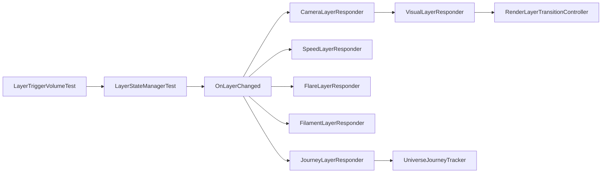

# Journey of the Light — Unity Project Rules

## Architecture Overview
This is a Unity 2019/2020 project using a modular layer/zone system.
Core pattern: LayerDefinition ScriptableObjects -> OnLayerChanged event ->
independent Responder scripts (JourneyLayerResponder, SpeedLayerResponder,
FlareLayerResponder, FilamentLayerResponder, VisualLayerResponder, CameraLayerResponder).

## Scope And Intent
- This document is the startup reference for work related to `PlaytestBuild`.
- Read this file before changing layer flow, camera transitions, travel HUD, or trigger behavior.
- Source scene: `Assets/Scenes/PlaytestBuild.unity`.

## PlaytestBuild Scene Map
- **Layer event core**
  - `LayerTriggerVolumeTest` volumes call `LayerStateManagerTest.RequestEnter(layerId, ...)`.
  - `LayerStateManagerTest` resolves active layer, tracks previous/current, and emits `OnLayerChanged`.
- **Layer profile data (ScriptableObject assets)**
  - `LayerCatalogTest` maps `layerId -> LayerDefinitionTest`.
  - `LayerDefinitionTest` stores timing, camera-sequence toggles, speed multipliers, flare/filament settings, journey pin targets, and nebula params.
- **Responder pipeline (event-driven)**
  - `JourneyLayerResponder`, `SpeedLayerResponder`, `FlareLayerResponder`, `FilamentLayerResponder`, `VisualLayerResponder`, `CameraLayerResponder`.
- **Support systems used by responders**
  - `RenderLayerTransitionController` (N-layer render group crossfade).
  - `UniverseJourneyTracker` (phase model and milestone tracking).
  - `CameraFlareFlash` (screen flash effect).
- **HUD / travel display in scene**
  - `UniverseTravelTracker` (macro+micro slider display, total-distance TMP text, unit switches by active layer).

## Scene Script Inventory (Detected In PlaytestBuild)
Detected from `m_Script` GUID references in `Assets/Scenes/PlaytestBuild.unity`.

### Core Layer Stack
- `Assets/Scenes/Ana's Playground/Ana's Assets/AnaLayer/LayerStateManagerTest.cs`
- `Assets/Scenes/Ana's Playground/Ana's Assets/AnaLayer/LayerTriggerVolumeTest.cs` (multiple instances)
- `Assets/Scenes/Ana's Playground/Ana's Assets/AnaLayer/JourneyLayerResponder.cs`
- `Assets/Scenes/Ana's Playground/Ana's Assets/AnaLayer/SpeedLayerResponder.cs`
- `Assets/Scenes/Ana's Playground/Ana's Assets/AnaLayer/VisualLayerResponder.cs`
- `Assets/Scenes/Ana's Playground/Ana's Assets/AnaLayer/CameraLayerResponder.cs`
- `Assets/Scenes/Ana's Playground/Ana's Assets/AnaLayer/RenderLayerTransitionController.cs`

### Journey / HUD / Player Related
- `Assets/Scripts/UniverseJourneyTracker.cs`
- `Assets/Scripts/UniverseTravelTracker.cs`
- `Assets/Scripts/DarkMatterPlayerControllerTest.cs`
- `Assets/EarthLayerResponderTest.cs`

### Related Visual/Scene Scripts Also Referenced
- `Assets/Scripts/PhotonTrailController.cs`
- `Assets/Scripts/PhotonSpectrumTrail.cs`
- `Assets/Scripts/CameraForwardGizmo.cs`
- `Assets/Scenes/Sunny's Playgrounds/Scripts/GraphFeeder.cs`
- `Assets/Scenes/Sunny's Playgrounds/Scripts/ForestHUDLine.cs`

### Note On Missing Script References
- `PlaytestBuild.unity` currently contains several `m_Script` GUIDs that do not resolve to `*.cs.meta` in this workspace.
- Treat these as potential missing/renamed scripts. Before refactors touching those objects, open `PlaytestBuild` in Unity and verify "Missing (Mono Script)" components.

## Layer System Contract
- `LayerTriggerVolumeTest`
  - Enters only on trigger enter; exit is intentionally ignored.
  - Optional tag filter; default player tag.
- `LayerStateManagerTest`
  - Owns authoritative current layer (`CurrentLayerId`, `CurrentDefinition`, `CurrentUniverseLayer`).
  - Emits:
    - `OnLayerChanged(LayerDefinitionTest previous, LayerDefinitionTest current)`
    - `OnPhaseChanged(LayerTransitionPhase)`
    - `OnStateChanged(LayerStateSnapshotTest)`
- `LayerCatalogTest`
  - Lookup table from `layerId` to `LayerDefinitionTest`.
  - Provides `GetDefaultDefinition()` for baseline layer semantics.
- `LayerDefinitionTest`
  - Behavior knobs consumed by responders:
    - Speed (`zoneSpeedMultiplier`, `returnSpeedMultiplier`, blend duration)
    - Camera sequencing (`useLookBackSequence`, hold delays)
    - Flare, filament, nebula rendering controls
    - HUD micro slider max
    - Journey phase pinning targets.

## Responder Pipeline (OnLayerChanged Consumers)
- `JourneyLayerResponder`
  - If layer is default: unpins journey phase.
  - Else: pins `UniverseJourneyTracker` to `phaseOnEnter`.
- `SpeedLayerResponder`
  - Tweens external speed multiplier on `DarkMatterPlayerControllerTest`.
- `FlareLayerResponder`
  - Plays `CameraFlareFlash` according to layer flare settings.
- `FilamentLayerResponder`
  - Tweens `_Transparency` on matching filament materials.
- `VisualLayerResponder`
  - Applies render-layer swaps/crossfades through `RenderLayerTransitionController`.
  - Also handles optional nebula shader tweening.
- `CameraLayerResponder`
  - Owns transition sequences and camera priority choreography.
  - Calls `VisualLayerResponder.CrossfadeTo(...)` at top-down timing points.

## Camera And Render Transition Sequence
- `CameraLayerResponder` is the sequence router:
  - Look-back sequence for designated entry layer(s).
  - Quasar-to-Macro path waits for orbit completion as needed.
  - Look-down enter/exit path uses TopDown camera cover.
- `VisualLayerResponder` no longer starts transition timing directly; it executes render swap when camera responder calls `CrossfadeTo`.
- `RenderLayerTransitionController` performs either instant swap or timed crossfade per layerId group.

## Journey / Distance / HUD Notes
- `UniverseJourneyTracker`
  - Tracks remaining distance, phase progress, and milestones from player movement.
  - Supports phase pin/unpin API used by `JourneyLayerResponder`.
- `UniverseTravelTracker`
  - Maintains one continuously accumulated total distance (`_totalUniverseDistanceLy`).
  - Macro slider always visible; micro slider visible only in non-macro layer.
  - Distance TMP text format:
    - `Total Distance: <value>`
    - `Unit: <unitLabel>`
  - Unit/value scaling follows active layer:
    - Macro: billions (`/ 1e9`, macro unit label)
    - Micro: 10k light-year units (`/ 1e4`, micro unit label)

## Safe Workflow Rules For Future Tasks
- **Startup checklist (always)**
  - Read `CURSOR_REFERENCE_PLAYTESTBUILD.md` first.
  - Confirm target behavior touches which subsystem: trigger/state, responder, camera, visual, HUD, or journey.
  - Identify whether change is data-only (`LayerDefinitionTest`/catalog) or code-path change.
- **When editing layer behavior**
  - Prefer data tweaks in `LayerDefinitionTest` first.
  - Keep `layerId` strings aligned across trigger volumes, catalog entries, and render groups.
- **When editing transitions**
  - Preserve ownership split:
    - Camera timing in `CameraLayerResponder`
    - Render swap execution in `VisualLayerResponder` / `RenderLayerTransitionController`.
- **When editing HUD/distance**
  - Keep total distance accumulation continuous unless explicitly changing game design.
  - Ensure unit conversion is explicit and tied to active layer semantics.
- **Before finalizing changes**
  - Verify no missing-script regressions in `PlaytestBuild` inspector.
  - Verify `OnLayerChanged` listeners still subscribe/unsubscribe correctly.

## Known Conventions
- `isDefaultLayer` indicates baseline/home layer behavior.
- Trigger exits do not change layer in `LayerTriggerVolumeTest`; entering a new trigger drives state transitions.
- Event-driven modularity is intentional: each responder should stay focused on one concern.
- For new layers, extend `LayerDefinitionTest` data and avoid hardcoding sequence logic unless absolutely necessary.
